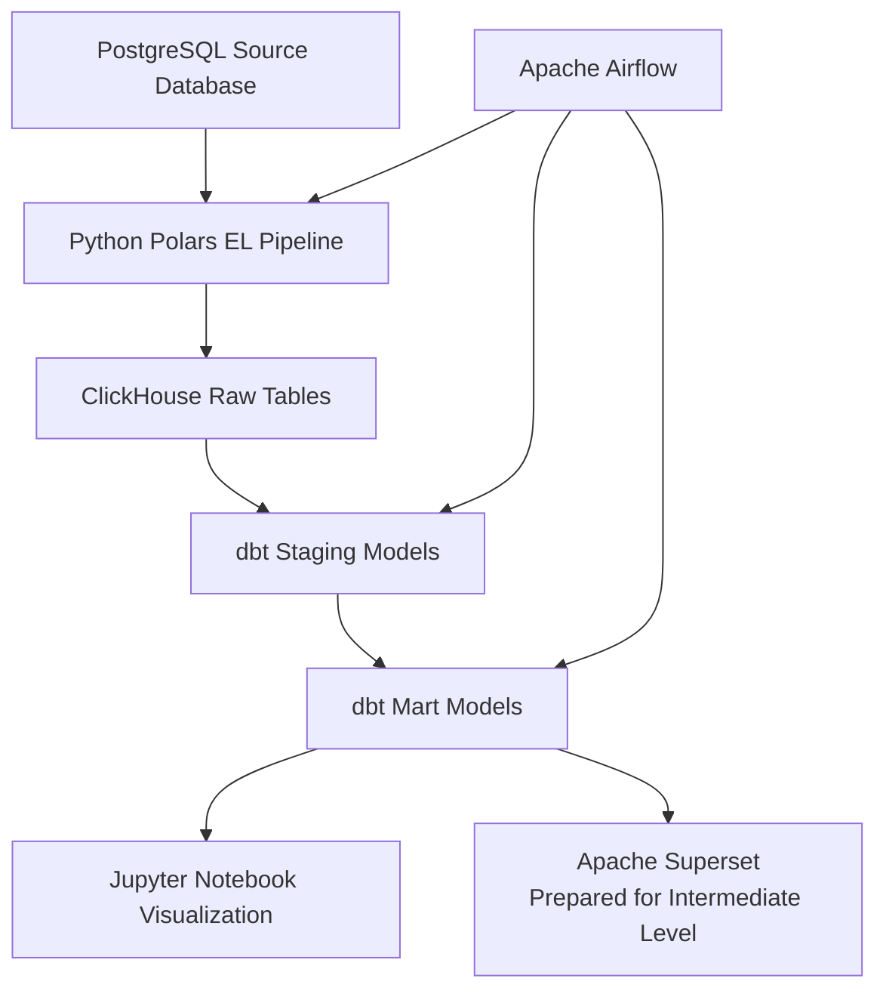

# Minimarket Cashier Data Pipeline Beginner - Level

## 1. Project Description

This project is an end-to-end data engineering pipeline for a minimarket cashier / point-of-sale system at a beginner-level. This project is for the take home test of the data engineering job application in Parkee.

The pipeline extracts transactional data from PostgreSQL, loads the raw data into ClickHouse, transforms the data using dbt into a dimensional star schema, orchestrates the workflow using Apache Airflow, and visualizes the analytical results using Jupyter Notebook.

This project is built for the **Data Engineer Take-Home Technical Test** at the Beginner level.

## 2. Tech Stack

| Component         | Tool                      | Notes                                             |
| ----------------- | ------------------------- | ------------------------                          |
| Source Database   | PostgreSQL                | OLTP                                              |
| Data Warehouse    | ClickHouse                | OLAP                                              |
| Pipeline Language | Python                    |                                                   |
| DataFrame Library | Polars                    | Pandas Alternative because it is too slow         |
| Transformation    | dbt Core + dbt-clickhouse |                                       |  
| Orchestration     | Apache Airflow            |                                       |
| Visualization     | Jupyter Notebook          |                                                   |
| Optional BI Tool  | Apache Superset           | Not being used in beginner-level                  |
| Containerization  | Docker Compose            |                                                   |

## 3. Architecture




## 4. Data Flow

```text
PostgreSQL
    ↓
Python Polars Extract & Load
    ↓
ClickHouse raw tables
    ↓
dbt staging models
    ↓
dbt mart models
    ↓
Jupyter Notebook analytics
```

## 5. Star Schema

The final mart layer follows a star schema.

```text
                    dim_date
                       |
dim_customer ---- fact_sales ---- dim_product
```

### Main mart tables

| Model          | Description                                     |
| -------------- | ----------------------------------------------- |
| `dim_customer` | Customer dimension to keep customer's data dimension         |
| `dim_product`  | Product dimension to keep every products                               |
| `dim_date`     | Date dimension generated from every transaction dates |
| `fact_sales`   | Sales fact table for every transaction items that was sold|

The data of `fact_sales` is **one row per transaction item**. This allows product-level analysis, such as top 5 products by category per cateogory.

## 6. Analytical Questions
Answers in the analysis.ipynb in the folder minimarket-cashier-data-pipeline/notebooks/

## 7. Repository Structure

```text
minimarket-cashier-data-pipeline/
├── README.md
├── docker-compose.yml
├── .env
├── .venv(python's virtual environment but need set up)
├── .gitignore
├── requirements.txt
|
├── airflow/
│   ├── Dockerfile
|   ├── logs 
│   └── dags/
│       └── minimarket_elt_dags.py
|       └── dags_config.py
│
├── dbt/
│   ├── Dockerfile
│   ├── requirements.txt
|   ├── logs/
│   └── minimarket_dbt/
│       ├── dbt_project.yml
│       ├── profiles.yml
│       └── models/
│           ├── staging/
|           |   ├── sources.yml
|           |   ├── stg_customers.sql 
|           |   ├── stg_products.sql 
|           |   ├── stg_transaction_items.sql
|           |   └── stg_transactions.sql
│           └── marts/
|               ├── sources.yml
|               ├── dim_customer.sql
|               ├── dim_date.sql
|               ├── dim_product.sql
|               └── fact_sales.sql
|               
│
├── init-scripts/
|   ├── airflow/
|   |   └── init_airflow.sh
│   ├── postgres/
|   |   ├── seed_data.sql        
│   │   └── init_postgres.sql
│   ├── clickhouse/
│   │   └── init_clickhouse.sql
│   └── dbt/
|       └── init_dbt.sh
│
├── logs/
|
├── notebooks/
│   └── analysis.ipynb
│
├── pipeline/
│   ├── Dockerfile
│   ├── requirements.txt
|   ├── loggings.py
│   ├── main.py
│   ├── settings.py
|   ├── clients/
|   |   └── databases.py
|   └── config/
|       └── tenants.json
|   
│
└── superset/
    ├── Dockerfile
    └── requirements.txt
```

## 8. Prerequisites

Make sure these tools are installed:

* Docker
* Docker Compose
* Git
* python

Check installation:

```bash
docker --version
docker compose version
git --version
python --version
```

## 9. Environment Variables

Copy the example environment file:

```bash
cp .env .env
```

Example `.env` values:

```env
POSTGRES_HOST=postgres
POSTGRES_PORT=5432
POSTGRES_DB=minimarket
POSTGRES_USER=postgres
POSTGRES_PASSWORD=postgres

CLICKHOUSE_HOST=clickhouse
CLICKHOUSE_PORT=8123
CLICKHOUSE_DB=minimarket
CLICKHOUSE_USER=clickhouse
CLICKHOUSE_PASSWORD=clickhouse

AIRFLOW_USERNAME=admin
AIRFLOW_PASSWORD=admin
AIRFLOW_POSTGRES_DB=airflow
AIRFLOW_POSTGRES_USER=airflow
AIRFLOW_POSTGRES_PASSWORD=airflow
AIRFLOW_POSTGRES_HOST=airflow-postgres
AIRFLOW_POSTGRES_PORT=5432
AIRFLOW_WEBSERVER_SECRET_KEY=airflowsecretkey
PROJECT_ROOT=//Users/Farrel/code/repos/minimarket-cashier-data-pipeline

JUPYTER_TOKEN=admin

SUPERSET_SECRET_KEY=supersecretkey
MINIMARKET_NETWORK_NAME=minimarket_network
```

Important:

* Use `clickhouse` as the ClickHouse host inside Docker.
* Use `localhost` only when connecting from the host machine.
* `PROJECT_ROOT` must use the absolute path to this project folder.

## 10. How to Run the Project

### Step 1: Build Docker images

```bash
docker compose build
```

### Step 2: Docker Compose Up

```bash
docker compose up -d
```

Airflow UI:

```text
http://localhost:8080
```

Default login:

```text
username: admin
password: admin
```

### Step 5: Start Jupyter Notebook

```bash
docker compose up -d jupyter
```

Jupyter will be available at:

```text
http://localhost:8888
```
use the JUPYTER_TOKEN for login or just run in your IDE

### Step 6: Optional, start Superset

```bash
docker compose up -d superset
```

Superset will be available at:

```text
http://localhost:8088
```

Default login:

```text
username: admin
password: admin
```

## 11. Run the EL Pipeline Manually

To run the Python Polars extract-and-load pipeline manually via airflow:
### Steps to run airflow
- 11.a Open Airflow Webserver
- 11.b Open minimarket_elt_pipeline dag
- 11.c Activate minimarket minimarket_elt_pipeline dag
- 11.d Wait for the dags to run

The DAG executes these tasks:

```text
run_python_polars_el
    ↓
dbt_debug
    ↓
dbt_run
    ↓
dbt_test
```

The DAG performs the full pipeline from raw extraction to dbt transformation and testing.

This loads data from PostgreSQL into ClickHouse raw tables.

Check ClickHouse row counts:

```bash
docker exec -it minimarket_clickhouse clickhouse-client \
  --user minimarket_user \
  --password minimarket_password \
  --database minimarket
```

Then run:

```sql
select count(*) from raw_customers;
select count(*) from raw_products;
select count(*) from raw_transactions;
select count(*) from raw_transaction_items;
```

## 13. Visualization

Open the notebook:

```text
notebooks/analysis.ipynb
```

SEE the answers in this notebook!

The notebook connects directly to ClickHouse and visualizes:

1. Top 5 products per category using a horizontal bar chart
2. Monthly revenue trend using a line chart
3. Payment method distribution using a pie chart

## 14. Useful URLs in local machine

| Service           | URL                     |
| ----------------- | ----------------------- |
| Airflow           | `http://localhost:8080` |
| Jupyter Notebook  | `http://localhost:8888` |
| Superset Optional | `http://localhost:8088` |
| ClickHouse HTTP   | `http://localhost:8123` |
| PostgreSQL        | `localhost:5432`        |

## 15. Reset the Project

To stop all services:

```bash
docker compose down
```

To stop all services and remove volumes:

```bash
docker compose down -v
```

Use `down -v` carefully because it deletes PostgreSQL, ClickHouse, and Airflow metadata volumes.

To rebuild from scratch:

```bash
docker compose down -v
docker compose build
docker compose up -d 
```

## 16. Troubleshooting

### ClickHouse connection refused

If the pipeline tries to connect to `localhost:8123` from inside Docker, update the environment variable:

```env
CLICKHOUSE_HOST=clickhouse
```

Inside Docker containers, use service names such as `clickhouse` and `postgres`.

### Airflow cannot read task logs, 403 Forbidden

Make sure all Airflow services use the same webserver secret key:

```env
AIRFLOW_WEBSERVER_SECRET_KEY=minimarket_airflow_secret_key_please_change
```

Also make sure webserver and scheduler share the logs volume:

```yaml
- ./logs:/opt/airflow/logs
```

### dbt cannot find ClickHouse

Check that `profiles.yml` uses environment variables and that the dbt container receives:

```env
CLICKHOUSE_HOST=clickhouse
CLICKHOUSE_PORT=8123
CLICKHOUSE_DB=minimarket
CLICKHOUSE_USER=minimarket_user
CLICKHOUSE_PASSWORD=minimarket_password
```

### Docker network not found

Make sure the Docker Compose network has a fixed name:

```yaml
networks:
  minimarket_network:
    name: minimarket_network
    driver: bridge
```

## 17. Video Walkthrough

Video walkthrough link:

```text
https://youtu.be/6XRu6hsudcs
```

The video demonstrates:

1. Docker Compose stack running
2. PostgreSQL and ClickHouse containers running
3. Airflow DAG success
4. dbt transformation success
5. Jupyter Notebook visualizations

## 18. Notes

This project uses a full-load approach for the Beginner level. Each run reloads the raw ClickHouse tables before dbt transforms the data into staging and mart models.

For production improvement, the pipeline can be extended with:

* Incremental loading using `created_at` or `updated_at` watermarks
* Data quality checks using dbt tests, Soda Core, or Great Expectations
* More robust alerting in Airflow
* Centralized secrets management
* Superset dashboard as a production-style BI layer
