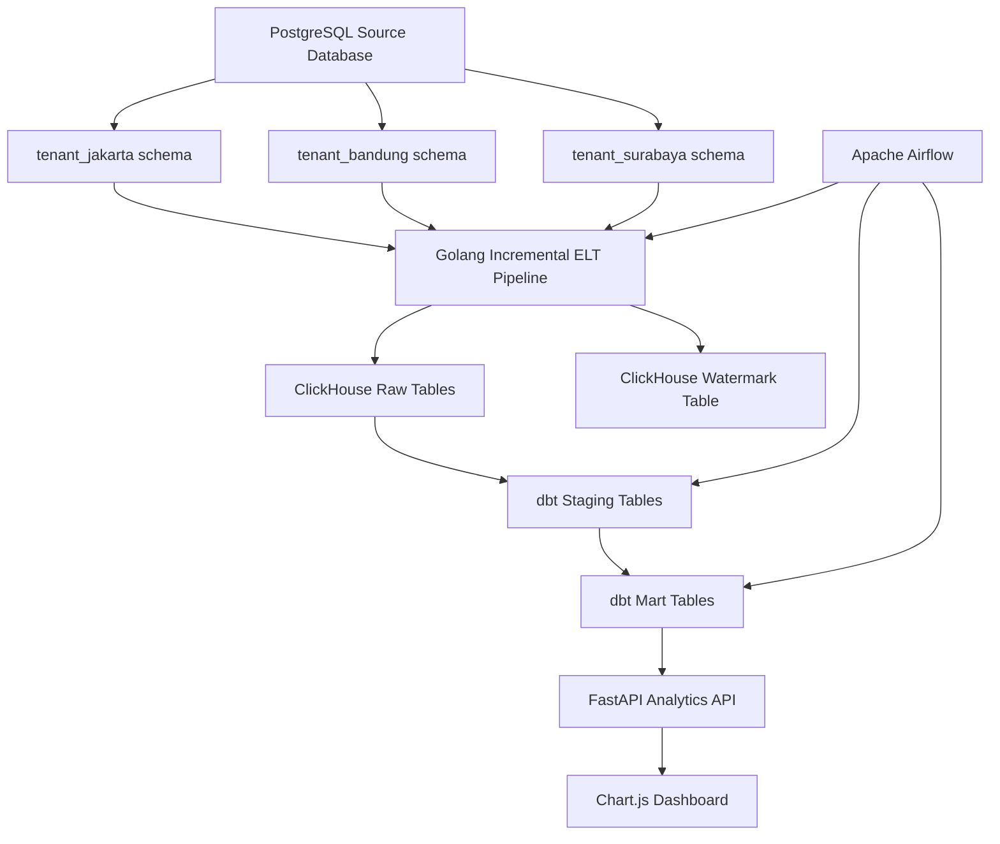

# Minimarket Cashier Data Pipeline - Intermediate Level

## 1. Project Description

This project is an end-to-end **Data Engineering pipeline** for a minimarket cashier / point-of-sale system. It was built for a Data Engineer take-home technical test.

The project simulates a multi-tenant minimarket environment where each tenant has its own PostgreSQL schema. A Golang pipeline extracts data from PostgreSQL, loads raw data into ClickHouse, dbt transforms the data into staging and mart tables, Airflow orchestrates the workflow, and FastAPI + Chart.js serve the analytics dashboard.

This version focuses on the **Intermediate Level** implementation.

---

## 2. Main Features

- Multi-tenant PostgreSQL source using separate schemas:
  - `tenant_jakarta`
  - `tenant_bandung`
  - `tenant_surabaya`
- Golang ELT pipeline with goroutine-based tenant processing
- Hybrid incremental loading using ClickHouse watermark table
- ClickHouse as OLAP data warehouse
- dbt staging and mart models as physical tables
- Tenant-aware star schema
- Airflow orchestration
- FastAPI analytics API
- Chart.js web dashboard
- Docker Compose based local development environment

---

## 3. Tech Stack

| Component | Tool | Purpose |
| --- | --- | --- |
| Source Database | PostgreSQL | Multi-tenant OLTP source |
| Data Warehouse | ClickHouse | OLAP storage and analytics |
| Pipeline Language | Golang | Intermediate ELT pipeline |
| Concurrency | Goroutines + WaitGroup | Parallel tenant processing |
| Transformation | dbt Core + dbt-clickhouse | Staging and mart transformations |
| Orchestration | Apache Airflow | Workflow scheduling |
| API Layer | FastAPI | Analytics API endpoints |
| Dashboard | Chart.js + Nginx | Simple analytics dashboard |
| Containerization | Docker Compose | Local service orchestration |
| Optional Notebook | Jupyter Notebook | Exploratory validation |

---

## 4. Architecture



---

## 5. Data Flow

```text
PostgreSQL tenant schemas
        ↓
Golang ELT pipeline
        ↓
ClickHouse raw tables
        ↓
dbt staging tables
        ↓
dbt mart tables
        ↓
FastAPI analytics API
        ↓
Chart.js dashboard
```

---

## 6. Multi-Tenant Source Design

The PostgreSQL source database contains three tenant schemas:

```text
tenant_jakarta
tenant_bandung
tenant_surabaya
```

Each schema contains the same operational tables:

```text
customers
products
stores
promotions
suppliers
transactions
transaction_items
transaction_promotions
```

The same local IDs may exist in different tenant schemas. For example:

```text
tenant_jakarta.customer_id = 1
tenant_bandung.customer_id = 1
tenant_surabaya.customer_id = 1
```

Because of this, every raw, staging, and mart table includes `tenant_id`.

---

## 7. Incremental Loading Strategy

The Golang pipeline uses a **hybrid loading strategy**.

### Incremental tables

These source tables have reliable timestamp columns, so they use watermark-based incremental extraction:

| Source Table | Watermark Column |
| --- | --- |
| `customers` | `created_at` |
| `products` | `created_at` |
| `suppliers` | `created_at` |
| `transactions` | `transaction_date` |

### Full-refresh-by-tenant tables

These tables do not have reliable `created_at` or `updated_at` columns, so they are refreshed per tenant:

| Source Table | Reason |
| --- | --- |
| `stores` | No reliable incremental timestamp |
| `promotions` | No reliable incremental timestamp |
| `transaction_items` | No reliable incremental timestamp |
| `transaction_promotions` | No reliable incremental timestamp |

This design keeps the pipeline realistic: watermark logic is used only where the source data supports it, while non-incremental child/reference tables are refreshed to preserve correctness.

---

## 8. Watermark Table

The watermark state is stored in ClickHouse:

```sql
CREATE TABLE IF NOT EXISTS minimarket.elt_watermarks (
    tenant_id String,
    table_name String,
    watermark_column String,
    last_watermark DateTime,
    processed_at DateTime
)
ENGINE = ReplacingMergeTree(processed_at)
ORDER BY (tenant_id, table_name);
```

Column meaning:

| Column | Description |
| --- | --- |
| `tenant_id` | Tenant being processed |
| `table_name` | Source table name |
| `watermark_column` | Timestamp column used for incremental extraction |
| `last_watermark` | Latest source timestamp already loaded |
| `processed_at` | When the pipeline saved the watermark state |

---

## 9. ClickHouse Raw Tables

The Golang pipeline loads data into these ClickHouse raw tables:

```text
raw_customers
raw_products
raw_stores
raw_promotions
raw_suppliers
raw_transactions
raw_transaction_items
raw_transaction_promotions
elt_watermarks
```

Every raw table contains:

```text
tenant_id
loaded_at
```

`tenant_id` prevents cross-tenant ID collisions. `loaded_at` records when the row was loaded into ClickHouse.

---

## 10. dbt Transformation Layer

dbt is used to transform raw data into staging and mart layers.

### Staging tables

The staging layer is materialized as **physical tables**, not views.

```text
stg_customers
stg_products
stg_stores
stg_promotions
stg_suppliers
stg_transactions
stg_transaction_items
stg_transaction_promotions
```

The staging layer standardizes column names, preserves `tenant_id`, applies basic cleaning, and filters completed transactions.

`stg_transactions` filters only completed transactions:

```sql
where lower(status) = 'completed'
```

### Mart tables

```text
dim_customer
dim_product
dim_store
dim_promotion
dim_date
fact_sales
fact_promotion_usage
```

The mart layer is also materialized as physical tables.

---

## 11. Star Schema

The final mart layer follows a tenant-aware star schema.

```text
                       dim_date
                          |
dim_customer ---- fact_sales ---- dim_product
                          |
                      dim_store
```

Promotion analytics uses a separate fact table:

```text
dim_promotion ---- fact_promotion_usage ---- dim_date
```

### Main mart tables

| Model | Description |
| --- | --- |
| `dim_customer` | Customer dimension |
| `dim_product` | Product dimension |
| `dim_store` | Store dimension |
| `dim_promotion` | Promotion dimension |
| `dim_date` | Date dimension generated from transactions |
| `fact_sales` | Sales fact table at transaction-item grain |
| `fact_promotion_usage` | Promotion usage fact table |

### Fact grain

`fact_sales` uses this grain:

```text
1 row = 1 transaction item
```

Because of this, transaction counts must use:

```sql
countDistinct(transaction_key)
```

not:

```sql
count(*)
```

---

## 12. Tenant-Aware Keys

The mart layer creates tenant-aware keys to avoid cross-tenant collisions.

Example:

```sql
concat(tenant_id, '-', toString(customer_id)) as customer_key
```

Example keys:

```text
tenant_jakarta-1
tenant_bandung-1
tenant_surabaya-1
```

All fact joins include `tenant_id`.

Example:

```sql
inner join stg_transactions t
    on ti.tenant_id = t.tenant_id
    and ti.transaction_id = t.transaction_id
```

---

## 13. Analytics API

FastAPI exposes analytics endpoints from the dbt mart tables.

Base URL:

```text
http://localhost:8000
```

API documentation:

```text
http://localhost:8000/docs
```

### Endpoints

| Endpoint | Description |
| --- | --- |
| `/api/summary` | Total revenue, transactions, customers, and average basket size |
| `/api/revenue-by-store` | Revenue and transaction count by store |
| `/api/promotion-effectiveness` | Promotion usage and promoted revenue |
| `/api/top-products-by-city` | Top products by city |
| `/api/customer-segments` | Customer segmentation by spending |
| `/api/transactions-by-day` | Transactions and revenue by day of week |

---

## 14. Dashboard

The dashboard is built using Chart.js and served with Nginx.

Dashboard URL:

```text
http://localhost:3000
```

Charts included:

1. Total Revenue KPI
2. Total Transactions KPI
3. Total Customers KPI
4. Average Basket Size KPI
5. Revenue by Store
6. Promotion Effectiveness
7. Top Products by City
8. Customer Segments
9. Transactions by Day

---

## 15. Repository Structure

```text
minimarket-cashier-data-pipeline/
├── README.md
├── docker-compose.yml
├── .env
├── .gitignore
│
├── airflow/
│   ├── Dockerfile
│   └── dags/
│       ├── minimarket_elt_dags.py
│       └── dags_config.py
│
├── api/
│   ├── Dockerfile
│   ├── requirements.txt
│   ├── main.py
│   └── app/
│       ├── __init__.py
│       ├── database.py
│       ├── routers/
│       │   ├── __init__.py
│       │   └── analytics_router.py
│       └── services/
│           ├── __init__.py
│           └── analytics_service.py
│
├── dashboard/
│   ├── Dockerfile
│   ├── index.html
│   └── app.js
│
├── dbt/
│   ├── Dockerfile
│   ├── requirements.txt
│   └── minimarket_dbt/
│       ├── dbt_project.yml
│       ├── profiles.yml
│       └── models/
│           ├── sources.yml
│           ├── staging/
│           │   ├── stg_customers.sql
│           │   ├── stg_products.sql
│           │   ├── stg_stores.sql
│           │   ├── stg_promotions.sql
│           │   ├── stg_suppliers.sql
│           │   ├── stg_transactions.sql
│           │   ├── stg_transaction_items.sql
│           │   └── stg_transaction_promotions.sql
│           └── marts/
│               ├── dim_customer.sql
│               ├── dim_product.sql
│               ├── dim_store.sql
│               ├── dim_promotion.sql
│               ├── dim_date.sql
│               ├── fact_sales.sql
│               └── fact_promotion_usage.sql
│
├── init-scripts/
│   ├── airflow/
│   │   └── init_airflow.sh
│   ├── postgres/
│   │   ├── init_postgres.sql
│   │   └── seed_data.sql
│   ├── clickhouse/
│   │   └── init_clickhouse.sql
│   └── dbt/
│       └── init_dbt.sh
│
├── notebooks/
│   └── analysis.ipynb
│
├── pipeline/
│   ├── python/
│   │   ├── Dockerfile
│   │   ├── requirements.txt
│   │   └── main.py
│   └── go/
│       ├── Dockerfile
│       ├── go.mod
│       ├── go.sum
│       ├── main.go
│       ├── config/
│       │   └── tenants.json
│       └── internal/
│           ├── app/
│           ├── config/
│           ├── database/
│           ├── extractor/
│           ├── loader/
│           ├── models/
│           └── watermark/
│
└── logs/
```

---

## 16. Prerequisites

Make sure these tools are installed:

```text
Docker
Docker Compose
Git
```

Check installation:

```bash
docker --version
docker compose version
git --version
```

---

## 17. Environment Variables

Create a `.env` file in the project root.

Example:

```env
POSTGRES_HOST=postgres
POSTGRES_PORT=5432
POSTGRES_DB=minimarket
POSTGRES_USER=postgres
POSTGRES_PASSWORD=postgres
POSTGRES_SSLMODE=disable

CLICKHOUSE_HOST=clickhouse
CLICKHOUSE_PORT=8123
CLICKHOUSE_NATIVE_PORT=9000
CLICKHOUSE_DB=minimarket
CLICKHOUSE_USER=minimarket_user
CLICKHOUSE_PASSWORD=minimarket_password

AIRFLOW_USERNAME=admin
AIRFLOW_PASSWORD=admin
AIRFLOW_POSTGRES_DB=airflow
AIRFLOW_POSTGRES_USER=airflow
AIRFLOW_POSTGRES_PASSWORD=airflow
AIRFLOW_POSTGRES_HOST=airflow-postgres
AIRFLOW_POSTGRES_PORT=5432
AIRFLOW_WEBSERVER_SECRET_KEY=minimarket_airflow_secret_key_please_change

JUPYTER_TOKEN=admin

MINIMARKET_NETWORK_NAME=minimarket_network
```

Important notes:

- Use `clickhouse` as the ClickHouse host from inside Docker containers.
- Use `localhost` only when connecting from the host machine.
- Go ClickHouse native client uses port `9000`.
- Python, dbt, and FastAPI use ClickHouse HTTP port `8123`.

---

## 18. How to Run the Project

### Step 1: Build Docker images

```bash
docker compose build
```

### Step 2: Start all services

```bash
docker compose up -d
```

### Step 3: Check running containers

```bash
docker compose ps
```

---

## 19. Run the Go ELT Pipeline Manually

```bash
docker compose build pipeline_go
docker compose run --rm pipeline_go
```

The Go pipeline processes tenants using goroutines.

Expected behavior on the first run:

```text
customers       rows > 0
products        rows > 0
suppliers       rows > 0
transactions    rows > 0
stores                  full refresh
promotions              full refresh
transaction_items       full refresh
transaction_promotions  full refresh
```

Expected behavior on the second run:

```text
customers       rows = 0
products        rows = 0
suppliers       rows = 0
transactions    rows = 0
```

The full-refresh tables still reload per tenant.

---

## 20. Validate Raw Tables

Open ClickHouse:

```bash
docker exec -it minimarket_clickhouse clickhouse-client \
  --user minimarket_user \
  --password minimarket_password \
  --database minimarket
```

Validate raw counts:

```sql
SELECT 'raw_customers' AS table_name, tenant_id, count(*) AS row_count
FROM raw_customers
GROUP BY tenant_id

UNION ALL

SELECT 'raw_products', tenant_id, count(*)
FROM raw_products
GROUP BY tenant_id

UNION ALL

SELECT 'raw_stores', tenant_id, count(*)
FROM raw_stores
GROUP BY tenant_id

UNION ALL

SELECT 'raw_promotions', tenant_id, count(*)
FROM raw_promotions
GROUP BY tenant_id

UNION ALL

SELECT 'raw_suppliers', tenant_id, count(*)
FROM raw_suppliers
GROUP BY tenant_id

UNION ALL

SELECT 'raw_transactions', tenant_id, count(*)
FROM raw_transactions
GROUP BY tenant_id

UNION ALL

SELECT 'raw_transaction_items', tenant_id, count(*)
FROM raw_transaction_items
GROUP BY tenant_id

UNION ALL

SELECT 'raw_transaction_promotions', tenant_id, count(*)
FROM raw_transaction_promotions
GROUP BY tenant_id

ORDER BY table_name, tenant_id;
```

Validate watermarks:

```sql
SELECT
    tenant_id,
    table_name,
    watermark_column,
    max(last_watermark) AS last_watermark,
    max(processed_at) AS last_processed_at
FROM elt_watermarks
GROUP BY
    tenant_id,
    table_name,
    watermark_column
ORDER BY
    tenant_id,
    table_name;
```

---

## 21. Run dbt

Run all dbt models:

```bash
docker compose run --rm dbt dbt run
```

Run dbt tests:

```bash
docker compose run --rm dbt dbt test
```

Run only staging:

```bash
docker compose run --rm dbt dbt run --select staging
```

Run only marts:

```bash
docker compose run --rm dbt dbt run --select marts
```

---

## 22. Validate Staging Tables

```sql
SELECT 'stg_customers' AS table_name, count(*) AS row_count FROM stg_customers
UNION ALL
SELECT 'stg_products', count(*) FROM stg_products
UNION ALL
SELECT 'stg_stores', count(*) FROM stg_stores
UNION ALL
SELECT 'stg_promotions', count(*) FROM stg_promotions
UNION ALL
SELECT 'stg_suppliers', count(*) FROM stg_suppliers
UNION ALL
SELECT 'stg_transactions', count(*) FROM stg_transactions
UNION ALL
SELECT 'stg_transaction_items', count(*) FROM stg_transaction_items
UNION ALL
SELECT 'stg_transaction_promotions', count(*) FROM stg_transaction_promotions
ORDER BY table_name;
```

---

## 23. Validate Mart Tables

```sql
SELECT 'dim_customer' AS table_name, count(*) AS row_count FROM dim_customer
UNION ALL
SELECT 'dim_product', count(*) FROM dim_product
UNION ALL
SELECT 'dim_store', count(*) FROM dim_store
UNION ALL
SELECT 'dim_promotion', count(*) FROM dim_promotion
UNION ALL
SELECT 'dim_date', count(*) FROM dim_date
UNION ALL
SELECT 'fact_sales', count(*) FROM fact_sales
UNION ALL
SELECT 'fact_promotion_usage', count(*) FROM fact_promotion_usage
ORDER BY table_name;
```

Validate tenant-level sales:

```sql
SELECT
    tenant_id,
    count(*) AS row_count,
    countDistinct(transaction_key) AS transaction_count,
    sum(subtotal) AS total_sales
FROM fact_sales
GROUP BY tenant_id
ORDER BY tenant_id;
```

---

## 24. Run Airflow

Airflow UI:

```text
http://localhost:8080
```

Default login:

```text
username: admin
password: admin
```

Trigger the DAG:

```text
minimarket_intermediate_elt_pipeline
```

The DAG should run:

```text
run_go_pipeline
        ↓
run_dbt_models
        ↓
run_dbt_tests
```

---

## 25. Run FastAPI and Dashboard

Start the API and dashboard:

```bash
docker compose up -d analytics_api dashboard
```

FastAPI docs:

```text
http://localhost:8000/docs
```

Dashboard:

```text
http://localhost:3000
```

Test API endpoints:

```text
http://localhost:8000/api/summary
http://localhost:8000/api/revenue-by-store
http://localhost:8000/api/promotion-effectiveness
http://localhost:8000/api/top-products-by-city
http://localhost:8000/api/customer-segments
http://localhost:8000/api/transactions-by-day
```

---

## 26. Useful Local URLs

| Service | URL |
| --- | --- |
| Airflow | `http://localhost:8080` |
| FastAPI Docs | `http://localhost:8000/docs` |
| Chart.js Dashboard | `http://localhost:3000` |
| ClickHouse HTTP | `http://localhost:8123` |
| PostgreSQL | `localhost:5432` |
| Jupyter Notebook | `http://localhost:8888` |

---

## 27. Reset the Project

Stop services:

```bash
docker compose down
```

Stop services and delete volumes:

```bash
docker compose down -v
```

Rebuild from scratch:

```bash
docker compose down -v
docker compose build
docker compose up -d
```

Use `down -v` carefully because it deletes PostgreSQL, ClickHouse, and Airflow metadata volumes.

---

## 28. Troubleshooting

### ClickHouse connection refused

Inside Docker containers, use:

```env
CLICKHOUSE_HOST=clickhouse
```

Use `localhost` only from the host machine.

---

### ClickHouse table schema does not update

`CREATE TABLE IF NOT EXISTS` does not modify existing tables.

Drop and recreate the table, or reset volumes:

```bash
docker compose down -v
docker compose up -d --build
```

---

### dbt cannot find raw tables

Check `models/sources.yml`.

Make sure the source identifiers point to raw tables:

```yaml
sources:
  - name: raw
    database: minimarket
    schema: minimarket
    tables:
      - name: customers
        identifier: raw_customers
```

---

### API returns `UNKNOWN_IDENTIFIER`

This usually means the dbt mart table does not contain the column expected by the API.

Example:

```text
Unknown expression identifier tenant_id
```

Fix:

```bash
docker compose run --rm dbt dbt run --select marts --full-refresh
docker compose restart analytics_api
```

Then inspect the table:

```sql
DESCRIBE TABLE fact_promotion_usage;
```

---

### Dashboard cannot load data

The browser must call the API through localhost:

```javascript
const API_BASE_URL = "http://localhost:8000/api";
```

Do not use Docker service names such as `analytics_api` in frontend JavaScript because the browser does not know Docker DNS names.

---

### Airflow cannot read task logs, 403 Forbidden

Make sure all Airflow services use the same secret key:

```env
AIRFLOW_WEBSERVER_SECRET_KEY=minimarket_airflow_secret_key_please_change
```

Also make sure webserver and scheduler share the logs volume.

---

## 29. Demo Walkthrough Checklist

The demo should show:

1. Docker Compose services running
2. PostgreSQL tenant schemas and seed data
3. Golang pipeline running successfully
4. Watermark table after the first run
5. Second Go run loading zero incremental rows
6. dbt run and dbt test success
7. Airflow DAG success
8. FastAPI docs and JSON endpoints
9. Chart.js dashboard
10. ClickHouse mart validation queries

---

## 30. Production Improvements

Possible improvements:

- Add `updated_at` to every source table for stronger incremental loading
- Add CDC with Debezium and Kafka
- Add data quality checks with Great Expectations or Soda Core
- Add API authentication
- Add dashboard filters by tenant/date/category
- Add observability and alerting
- Add centralized secret management
- Add CI/CD pipeline
- Add partitioning strategy in ClickHouse
- Add ReplacingMergeTree or partition replacement for idempotent raw loading

---

## 31. Notes

This project started as a Beginner-level full-load pipeline using Python and Polars, then was extended into an Intermediate-level multi-tenant ELT pipeline using Golang.

The current version uses:

```text
Golang for multi-tenant raw loading
ClickHouse for OLAP storage
dbt for staging and mart transformations
Airflow for orchestration
FastAPI for analytics endpoints
Chart.js for dashboard visualization
```

Apache Superset was explored as an optional BI layer, but the final dashboard implementation uses FastAPI and Chart.js because it is simpler, easier to control, and better aligned with the Intermediate technical test requirement.
